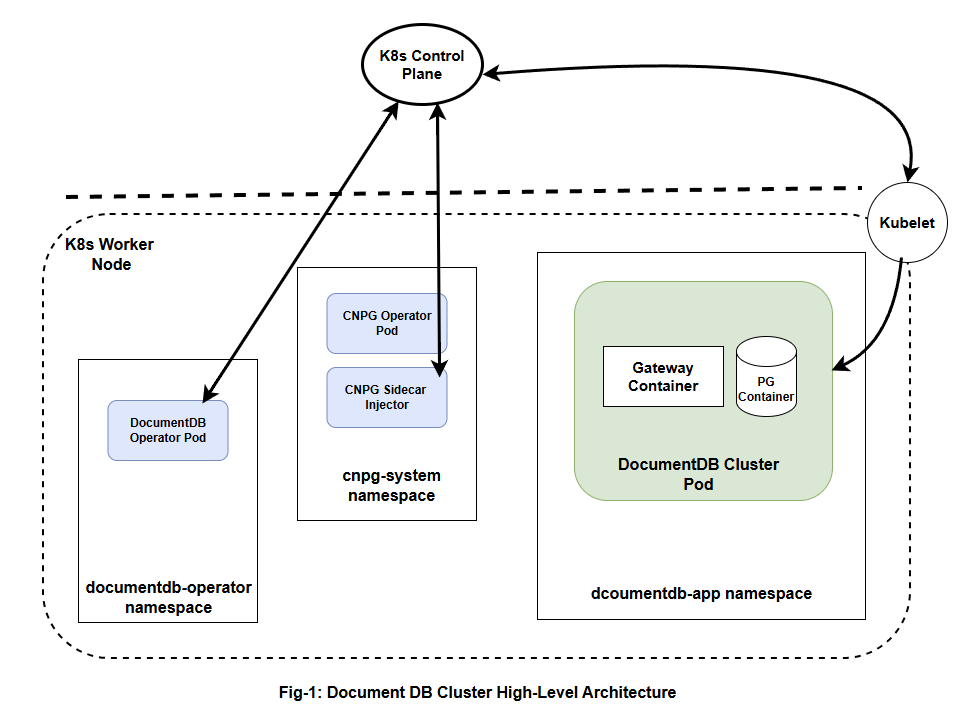

# DocumentDB Kubernetes Operator Upgrade Design

## Overview

This document outlines the upgrade strategy for the DocumentDB Kubernetes operator, which provides a MongoDB-compatible API layer over PostgreSQL using the CloudNative-PG (CNPG) operator. The system consists of multiple components that require coordinated upgrades to ensure service continuity and data integrity.

## Required Knowledge

The following sections provide essential background information for implementing DocumentDB operator upgrades:

### 1. Kubernetes Operators
Kubernetes operators extend the API to manage complex applications through custom resources and controllers that continuously reconcile desired state. Operators use admission webhooks to validate and modify resources during creation and updates.

**Learn more**: [Kubernetes Operator Pattern](https://kubernetes.io/docs/concepts/extend-kubernetes/operator/) | [Operator White Paper](https://github.com/cncf/tag-app-delivery/blob/163962c4b1cd70d085107fc579e3e04c2e14d59c/operator-wg/whitepaper/Operator-WhitePaper_v1-0.md) | [Custom Resources](https://kubernetes.io/docs/concepts/extend-kubernetes/api-extension/custom-resources/) | [Admission Controllers](https://kubernetes.io/docs/reference/access-authn-authz/admission-controllers/)

### 2. DocumentDB Operator Architecture
The DocumentDB operator provides a MongoDB-compatible API over PostgreSQL by orchestrating multiple components: the operator controller, gateway containers for protocol translation, PostgreSQL clusters with DocumentDB extensions, and sidecar injection for seamless integration with CloudNative-PG (CNPG) operator.

**Learn more**: [DocumentDB Operator README](../../../README.md) | [CloudNative-PG Documentation](https://cloudnative-pg.io/documentation/)

### 3. Helm Chart Management
Helm makes Kubernetes application packaging and deployment easy by bundling multiple related resources into a single chart. We provide a DocumentDB operator Helm chart that customers can install with a single command, automatically deploying all necessary components including the DocumentDB operator, CNPG operator, sidecar injector, and associated configurations.

**Learn more**: [Helm Documentation](https://helm.sh/docs/) | [Managing CRDs with Helm](https://helm.sh/docs/chart_best_practices/custom_resource_definitions/) | [Helm Upgrade Process](https://helm.sh/docs/helm/helm_upgrade/)

### 4. PostgreSQL and Extensions
PostgreSQL version upgrades involve considerations for both the database engine and extensions, with major version upgrades requiring data migration and careful compatibility validation. Extension upgrades may modify schemas or data structures independently of the PostgreSQL version.

**Learn more**: [PostgreSQL Versioning Policy](https://www.postgresql.org/support/versioning/) | [PostgreSQL Upgrade Methods](https://www.postgresql.org/docs/current/upgrading.html) | [Extension Management](https://www.postgresql.org/docs/current/extend-extensions.html)

## Architecture Components

The DocumentDB operator consists of five main components distributed across different k8s namespaces and nodes:



### 1. DocumentDB Operator
A custom Kubernetes operator that manages DocumentDB custom resources and orchestrates the creation and lifecycle of CNPG PostgreSQL clusters. Runs in the `documentdb-operator` namespace on worker nodes.

### 2. Gateway Container  
A MongoDB protocol translator that runs as a sidecar container alongside PostgreSQL, converting MongoDB wire protocol requests into PostgreSQL queries. Deployed in customer application namespaces on worker nodes.

### 3. PostgreSQL with DocumentDB Extension
A PostgreSQL server enhanced with DocumentDB extensions that enable MongoDB-like document storage and querying capabilities over a relational database. Deployed in customer application namespaces on worker nodes.

### 4. CNPG Sidecar Injector
An admission webhook that automatically injects the Gateway container into CNPG PostgreSQL pods during deployment. Runs in the `cnpg-system` namespace on worker nodes.

### 5. CNPG Operator
The CloudNative-PG operator that handles PostgreSQL cluster lifecycle management, including high availability, backups, and upgrades. Runs in the `cnpg-system` namespace on worker nodes.

### Component Communication Flow

**Control Plane Interaction:**
- All operators (DocumentDB, CNPG, Sidecar Injector) communicate with the Kubernetes API server running on control plane nodes
- The API server validates requests and stores resource definitions in etcd
- The API server directs kubelet agents on worker nodes to apply changes to pods and containers

**Data Plane Deployment:**
- DocumentDB clusters (PostgreSQL + Gateway containers) are deployed in customer-specified application namespaces
- kubelet on worker nodes manages the actual pod lifecycle and container execution
- Application traffic flows directly to Gateway containers in the application namespaces

## Design Principles

Our upgrade strategy follows four core principles:

### 1. Zero-Downtime Principle
All upgrades maintain service availability through rolling updates and automatic rollback on failure.

### 2. Backward Compatibility Principle  
Support N-2 API versions with 6-month deprecation cycles for gradual migration.

### 3. Fail-Safe Operation Principle
Failed upgrades automatically rollback using atomic Helm operations and change detection.

### 4. Team Autonomy Principle
Clear separation: infrastructure teams upgrade operators, development teams migrate clusters.

## Goals and Non-Goals

### Goals
- **Zero-downtime upgrades**: All DocumentDB components upgrade without service interruption
- **Gradual migration capability**: Support API version migration over weeks/months timeline
- **Automated rollback**: Failed upgrades automatically revert to previous stable state
- **Team independence**: Platform and application teams operate on separate timelines
- **Operational simplicity**: Minimize complexity for development teams
- **Data integrity**: Guarantee no data loss during upgrade processes

### Non-Goals
- **Unlimited version history**: Only support N-2 API versions (latest 3 versions maximum)
- **Cross-cloud migration**: Upgrades within same Kubernetes cluster only
- **Automatic data migration**: Breaking schema changes require manual planning
- **Zero-configuration experience**: Some operational knowledge required
- **Real-time migration**: API migrations designed for planned execution windows
- **Multi-tenant upgrades**: Each DocumentDB cluster upgraded independently

## Versioning Strategy

**Important**: DocumentDB uses a **unified versioning strategy** where all components are versioned together for simplicity and compatibility assurance.

### Unified Versioning Approach

**Single Version for All Components:**
- **DocumentDB Operator Version**: `v1.2.3` controls all component versions
- **Gateway Image**: Automatically aligned (e.g., `ghcr.io/microsoft/documentdb/gateway:v1.2.3`)
- **PostgreSQL + Extension**: Automatically aligned (e.g., `mcr.microsoft.com/documentdb/documentdb:16.2-v1.2.3`)
- **Sidecar Injector**: Automatically aligned (e.g., `ghcr.io/microsoft/documentdb/sidecar-injector:v1.2.3`)
- **CNPG Operator**: Locked to DocumentDB version (e.g., DocumentDB v1.2.3 → CNPG v0.24.0)

**Benefits of Unified Versioning:**
- **Simplified Operations**: One version to track instead of managing multiple component versions
- **Guaranteed Compatibility**: All components tested together as a cohesive unit
- **Reduced Complexity**: Eliminates version matrix compatibility issues
- **Easier Rollbacks**: Single version rollback affects all components consistently
- **Clear Release Management**: Single release pipeline for all components

## Upgrade Scenarios

**With Unified Versioning**: All component upgrades are triggered by a single DocumentDB operator version upgrade. Individual component upgrades are not available to customers.

## Team Responsibilities and Multi-Version Support Strategy

DocumentDB uses a **multi-version API approach** where a single operator version supports multiple DocumentDB cluster versions simultaneously, enabling gradual migration without forcing upgrades.

### Multi-Version Support Architecture

**Single Operator, Multiple Cluster Versions:**
- **Operator v2**: Supports both DocumentDB cluster `v1` and `v2` APIs
- **Operator v3**: Supports DocumentDB cluster `v1` (deprecated), `v2`, and `v3` APIs  
- **Operator v4**: Supports DocumentDB cluster `v2`, `v3`, and `v4` APIs (v1 removed)

**API Deprecation Cycle:**
- **Version N**: Introduce new cluster API version
- **Version N+1**: Previous version marked as deprecated but still supported
- **Version N+2**: Deprecated version removed, only latest 2-3 versions supported

### Upgrade Process with Multi-Version Support

### Phase 1: Infrastructure Upgrade (Database Admin Team)
**Responsibility**: Upgrade DocumentDB operator to support new cluster versions
**Scope**: Operator-level components only
**Command**: Helm upgrade of DocumentDB operator chart

**What gets upgraded**:
- DocumentDB Operator controller (v1 → v2) - now supports both cluster v1 and v2
- CNPG Operator (if version change required)
- Sidecar Injector (v1 → v2) 
- CRDs with new v2 fields added, v1 fields maintained
- RBAC, and operator configurations

**What does NOT get upgraded**:
- Existing DocumentDB clusters remain on v1 API
- Applications continue using v1 DocumentDB features unchanged
- No data migration or application downtime
- **Backward Compatibility**: v2 operator fully supports existing v1 clusters

### Phase 2: Application Upgrade (Developer Team)  
**Responsibility**: Migrate individual DocumentDB clusters from v1 to v2 API
**Scope**: Per-cluster API version upgrades initiated by development teams
**Command**: `kubectl` command to trigger cluster API migration

**What gets upgraded**:
- Specific DocumentDB cluster API (v1 → v2)
- PostgreSQL + DocumentDB extension images (if different between versions)
- Gateway containers with v2 features
- Cluster configuration migrated to v2 schema
- Data migration (only if required for breaking changes)

**Developer Control**:
- Developers choose when to migrate each cluster's API version
- Gradual rollout across development, staging, production
- Application-specific testing and validation with v2 features
- Rollback capability per cluster (v2 → v1 downgrade)

**Benefits of Multi-Version Support Approach**:
- **Zero Forced Upgrades**: Clusters remain on their current API version until explicitly migrated
- **Gradual API Migration**: Developers control API version migration timeline independently
- **Risk Mitigation**: Test new API versions in dev/staging before production migration
- **Backward Compatibility**: Multiple cluster API versions supported simultaneously
- **Controlled Deprecation**: API versions deprecated gradually over multiple operator releases

**API Version Examples**: See [commands.md](./commands.md) for detailed workflow commands and API version migration examples.

### Phase 3: Component-Specific Upgrade Considerations

While all components upgrade together, each has specific characteristics:

#### Gateway Image Upgrade (API Version Dependent)
- **State**: **Stateless** - Gateway containers have no persistent state
- **Impact**: Medium (rolling restart of pods when API version changes)
- **Risk**: Low - No data loss risk, only temporary connection disruption
- **Risk Mitigation**: Multiple replicas with local HA ensure zero-downtime rolling restart; Gateway and PostgreSQL containers run in same pod, sharing HA benefits
- **Version Behavior**: Gateway features may differ between cluster API v1 and v2

#### PostgreSQL Database Upgrade (API Version Dependent)  
- **State**: **Stateful** - PostgreSQL contains persistent application data
- **Impact**: Variable (depends on API version differences)
- **Risk**: Variable - Data migration only required for breaking schema changes
- **Risk Mitigation**: Multiple replicas with local HA ensure customers can continue working during rolling updates; Gateway and PostgreSQL containers run in same pod, providing coordinated HA failover
- **Categories**:
  - **Same PostgreSQL Version**: Cluster API v1 → v2 with same PG version (low risk, configuration change only)
  - **Minor PostgreSQL Version**: Different PG minor versions between API versions (medium risk, rolling restart with HA failover)
  - **Major PostgreSQL Version**: Different PG major versions between API versions (high risk, data migration required with backup/restore procedures)

#### DocumentDB Postgres Extension Upgrade (API Version Dependent)
- **State**: **Stateful** - Extension may have API-specific features
- **Impact**: Variable (depends on extension differences between API versions)
- **Risk**: Variable - Extension schema changes only if API versions require different features
- **Risk Mitigation**: Extension compatibility testing during operator upgrade; rollback capability maintains previous extension versions if needed
- **Categories**:
  - **Compatible Extension**: Same extension version for both API versions (low risk)
  - **Enhanced Extension**: New features added for v2 API (medium risk, backward compatible)
  - **Breaking Extension Changes**: Schema modifications required for v2 API (high risk, requires migration planning)

#### Sidecar Injector Upgrade (Supports Multiple API Versions)
- **State**: **Stateless** - Injection webhook has no persistent state
- **Impact**: Medium (affects new pod creation, must support both API versions)
- **Risk**: Medium - Injection failures affect new PostgreSQL pods
- **Risk Mitigation**: Multi-version support ensures existing pods continue running; new pod creation uses appropriate API version configuration
- **Multi-Version Support**: Injector must handle both v1 and v2 cluster configurations

#### CNPG Operator Upgrade (API Version Independent)
- **Trigger**: Upgrade bundled with DocumentDB operator when CNPG version needs updating
- **Scope**: Control plane and data plane
- **Impact**: Variable (depends on CNPG upgrade requirements)
- **Risk Mitigation**: CNPG rolling updates maintain cluster availability; proven PostgreSQL HA mechanisms ensure data safety
- **API Independence**: CNPG typically unchanged between DocumentDB API versions

## Upgrade Strategies

**Multi-Version Support Approach**: DocumentDB uses a multi-version API strategy where a single operator version supports multiple DocumentDB cluster API versions simultaneously, enabling controlled migration.

### 1. Phase 1: Infrastructure Upgrade Strategy (Database Admin)

The operator infrastructure upgrade involves upgrading the control plane components while leaving existing DocumentDB clusters unchanged.

#### A. Infrastructure Components Upgrade

**Components Upgraded in Phase 1:**
- **DocumentDB Operator**: Controller with multi-version API support, webhooks, CRDs
- **Sidecar Injector**: Container injection webhook supporting multiple cluster API versions
- **CNPG Operator**: PostgreSQL cluster management (when version updates required)

**Components NOT Upgraded in Phase 1:**
- **DocumentDB Clusters**: Remain on current API version until Phase 2 migration
- **Gateway Images**: Stay at current version until API migration
- **PostgreSQL + Extension**: No changes to running databases until API migration

**Version Alignment Example (Phase 1):**
```yaml
# After Phase 1: Operator v2 supports cluster API v1 and v2
documentdb-operator: v2.0.0          # ✅ Upgraded (supports cluster API v1 + v2)
sidecar-injector: v2.0.0             # ✅ Upgraded (supports cluster API v1 + v2)
cnpg-operator: v0.26.0               # ✅ Upgraded (if required)
# Existing clusters remain on API v1
cluster-api-version: v1              # ⏸️ Not migrated yet
cluster-gateway: cluster-api-v1      # ⏸️ Not migrated yet  
cluster-postgres: cluster-api-v1     # ⏸️ Not migrated yet
```

#### B. Infrastructure Upgrade Process

**Single Helm Upgrade Approach (Database Admin):**

1. **Pre-upgrade validation** using Helm dry-run to identify potential issues
2. **Atomic upgrade execution** with rollback on failure using Helm's `--atomic` flag  
3. **Operator health verification** ensuring all operators reach ready state
4. **Multi-version compatibility check** ensuring v2 operator can manage both v1 and v2 cluster APIs

**Command Examples**: See [commands.md](./commands.md) for detailed Infrastructure Upgrade commands and validation.

**Upgrade Process Flow (Phase 1):**
1. **CNPG Operator** (if version update required)
2. **DocumentDB Operator** (CRDs with v2 fields, controller with multi-version support, webhooks, RBAC)
3. **Sidecar Injector** (webhook supporting both cluster API versions)
4. **Validation** that v2 operator can manage existing v1 clusters and create new v2 clusters

### 2. Phase 2: Cluster API Migration Strategy (Developer Teams)

The cluster API migration involves transitioning individual DocumentDB clusters from v1 to v2 API, initiated and controlled by development teams.

#### A. Per-Cluster API Migration Components

**Components Migrated in Phase 2 (per cluster):**
- **Cluster API Schema**: DocumentDB cluster configuration migrated from v1 to v2 fields
- **Gateway Image**: Updated to support v2 API features (if different from v1)
- **PostgreSQL + Extension**: Updated to support v2 API features (if different from v1)
- **Cluster Configuration**: Access to new v2 features and APIs

**Developer-Controlled Process:**
- **Gradual API Migration**: Migrate dev → staging → production clusters
- **Per-Application Timeline**: Each team controls their API migration schedule
- **Feature Testing**: Test v2 API features before production migration
- **Rollback Capability**: Individual cluster API version downgrade (v2 → v1) if needed

**Command Examples**: See [commands.md](./commands.md) for detailed Developer cluster API migration commands.

#### B. Cluster API Migration Process

**Developer-Initiated Commands:**
See [commands.md](./commands.md) for detailed cluster API migration commands including backup, migration, monitoring, and rollback procedures.

**Cluster API Migration Process Flow (Phase 2):**
1. **Pre-migration backup** (if required for significant changes)
2. **API schema migration** from v1 to v2 fields and configuration  
3. **Rolling update** of PostgreSQL pods with v2-compatible images (if needed)
4. **Gateway container restart** with v2 API support (if needed)
5. **Configuration validation** of cluster functionality with v2 API
6. **Application testing** with v2 API features

### 3. Multi-Version API Support Examples

#### Example 1: Operator v2 Supporting Cluster API v1 and v2
**Phase 1 (Database Admin):**
Operator infrastructure upgrade: v1 → v2
- Operator components: v1 → v2 (now supports cluster API v1 + v2)
- Existing clusters: remain on cluster API v1
- New clusters: can be created with either cluster API v1 or v2

**Phase 2 (Developer Teams - when ready):**
Each team migrates cluster API version from v1 to v2 individually

**API Coexistence**: Operator v2 manages both cluster API v1 and v2 simultaneously

**Command Examples**: See [commands.md](./commands.md) for detailed multi-version API commands.

#### Example 2: Operator v3 with API Deprecation (Medium Risk)
**Phase 1 (Database Admin):**
Operator infrastructure upgrade: v2 → v3
- Operator components: v2 → v3 (supports cluster API v1-deprecated, v2, v3)
- Cluster API v1: marked as deprecated but still functional
- Existing clusters: all versions continue running unchanged

**Phase 2 (Developer Teams - gradual API migration):**
Week 1: Development clusters (v1 → v2 or v1 → v3)
Week 2: Staging validation
Week 3: Production (after testing new API versions)

**Command Examples**: See [commands.md](./commands.md) for detailed API deprecation migration commands.

#### Example 3: Operator v4 with API Removal (High Risk)
**Phase 1 (Database Admin):**
Operator infrastructure upgrade: v3 → v4
- All operator components: v3 → v4 (supports cluster API v2, v3, v4)
- Cluster API v1: removed (no longer supported)
- **Prerequisites**: All clusters must be migrated off cluster API v1 before operator upgrade

**Phase 2 (Developer Teams - careful migration):**
Month 1: Development clusters (v2 → v3 or v2 → v4)
Month 2: Staging environment validation
Month 3: Production (after extensive testing)

**Command Examples**: See [commands.md](./commands.md) for detailed API removal migration commands.

## Failure Modes and Recovery

### Operator Infrastructure Failures

#### Scenario: Helm Upgrade Fails During CRD Update
**Impact**: New clusters cannot be created, existing clusters unaffected
**Probability**: Medium (complex CRD schema changes)
**Detection**: Helm upgrade timeout or validation errors
**Recovery**: 
- Automatic Helm rollback via `--atomic` flag
- Manual CRD cleanup if needed: `kubectl delete crd documentdbs.db.microsoft.com`
- Re-apply previous operator version
**Prevention**: 
- Mandatory Helm dry-run validation before upgrade
- Staged rollouts in non-production environments first
- CRD schema compatibility testing in CI/CD

#### Scenario: DocumentDB Operator Pod Crash During Upgrade
**Impact**: Existing clusters stable, new cluster creation blocked
**Probability**: Low (robust health checks)
**Detection**: Pod restart loops, operator health check failures
**Recovery**:
- Kubernetes restarts operator pod automatically
- If persistent failure, Helm rollback to previous version
- Check resource limits and node capacity
**Prevention**:
- Resource requests/limits properly configured
- Health checks with appropriate timeouts
- Pod disruption budgets prevent simultaneous restarts

### API Migration Failures

#### Scenario: Cluster API Migration Fails Mid-Process
**Impact**: Single cluster affected, others continue operating normally
**Probability**: Low (pre-migration validation)
**Detection**: API migration timeout, cluster status degradation
**Recovery**:
- Per-cluster rollback to previous API version
- `kubectl patch documentdb cluster-name --type='merge' -p '{"apiVersion": "db.microsoft.com/v1"}'`
- Restore from pre-migration backup if data corruption
**Prevention**:
- Mandatory backup before API migration
- Pre-migration cluster health validation
- Staged migration (dev → staging → production)

#### Scenario: Gateway Container Fails to Start with New API Version
**Impact**: MongoDB connectivity lost for single cluster
**Probability**: Medium (configuration incompatibilities)
**Detection**: Pod crash loops, connection test failures
**Recovery**:
- Rolling restart of PostgreSQL pods
- Revert to previous gateway image version
- Manual configuration correction if needed
**Prevention**:
- Container image compatibility testing
- Canary deployment for new gateway versions
- Comprehensive integration test suite

### Split-Brain and Consistency Failures

#### Scenario: Network Partition During Rolling Upgrade
**Impact**: Potential data inconsistency between replicas
**Probability**: Low (robust network infrastructure)
**Detection**: CNPG cluster status reports split-brain condition
**Recovery**:
- CNPG automatic recovery mechanisms engage
- Manual intervention for prolonged partitions
- Restore from backup if data corruption detected
**Prevention**:
- Extended timeout windows for network instability
- Proper health checks with retry logic
- Network monitoring and alerting

#### Scenario: Concurrent API Migrations Cause Resource Conflicts
**Impact**: Multiple clusters fail migration simultaneously
**Probability**: Very Low (developer coordination)
**Detection**: Resource exhaustion, multiple cluster failures
**Recovery**:
- Throttle concurrent migrations
- Prioritize critical production clusters
- Staged rollback of failed migrations
**Prevention**:
- API migration coordination guidelines
- Resource capacity planning
- Automated migration scheduling

## Trade-off Analysis

This section analyzes key architectural decisions where we had to choose between competing approaches. Each trade-off explains the alternatives considered and why we selected our approach.

### Multi-Version API Support vs Single Version Enforcement
**The Choice**: Support 2-3 API versions simultaneously in single operator
**Alternative Rejected**: Force all clusters to upgrade to latest API version immediately
**Trade-offs**:
- **Choosing Multi-Version Support**:
  - ✅ **Benefit**: 6-month migration windows, 90% reduction in forced upgrade incidents
  - ❌ **Cost**: ~30% increase in operator codebase size, additional testing matrix
- **Alternative (Single Version)**:
  - ✅ **Benefit**: Simpler codebase, single testing path
  - ❌ **Cost**: Breaking changes force immediate migrations, higher operational risk
**Decision**: Accept complexity to enable gradual migrations (customer requirement)

### Unified Versioning vs Component Independence  
**The Choice**: All components versioned together with single release
**Alternative Rejected**: Independent versioning for each component (operator, gateway, postgres, etc.)
**Trade-offs**:
- **Choosing Unified Versioning**:
  - ✅ **Benefit**: Single version to track, eliminates version matrix compatibility testing
  - ❌ **Cost**: Larger upgrade surface area, more components change per upgrade
- **Alternative (Independent Versioning)**:
  - ✅ **Benefit**: Granular control, smaller upgrade scope per component
  - ❌ **Cost**: Complex version matrix (5 components × multiple versions), compatibility hell
**Decision**: Prioritize operational simplicity over granular control

### Rolling vs Blue-Green Upgrades
**The Choice**: Rolling upgrades as default, blue-green for major versions only
**Alternative Rejected**: Blue-green deployments for all upgrades
**Trade-offs**:
- **Choosing Rolling Upgrades**:
  - ✅ **Benefit**: Uses existing capacity, saves ~50% infrastructure costs
  - ❌ **Cost**: Higher failure rate (0.1% vs 0.01%), temporary service degradation
- **Alternative (Blue-Green Only)**:
  - ✅ **Benefit**: Near-zero downtime, instant rollback capability
  - ❌ **Cost**: Requires 2x resources, complex networking setup
**Decision**: Use rolling for cost efficiency, blue-green only for high-risk scenarios

### Automatic vs Manual Rollbacks
**The Choice**: Automatic rollback for infrastructure, manual approval for data plane
**Alternative Rejected**: Fully automatic rollbacks for all components
**Trade-offs**:
- **Choosing Hybrid Approach**:
  - ✅ **Benefit**: Fast recovery for infrastructure (95% faster), human oversight for data
  - ❌ **Cost**: Requires on-call engineering judgment for data plane issues
- **Alternative (Fully Automatic)**:
  - ✅ **Benefit**: Fastest possible recovery, no human intervention needed
  - ❌ **Cost**: Risk of automatic rollback making data corruption worse
**Decision**: Automatic for stateless, manual approval for stateful components

### Team Autonomy vs Centralized Control
**The Choice**: Split responsibility between platform teams (infrastructure) and application teams (cluster migration)
**Alternative Rejected**: Single team controls all upgrade phases
**Trade-offs**:
- **Choosing Split Responsibility**:
  - ✅ **Benefit**: 80% reduction in coordination overhead, teams work independently
  - ❌ **Cost**: Clear boundaries needed, escalation paths for edge cases
- **Alternative (Centralized Control)**:
  - ✅ **Benefit**: Single point of responsibility, consistent upgrade process
  - ❌ **Cost**: Bottlenecks on single team, slower overall upgrade velocity
**Decision**: Accept coordination complexity for improved team velocity

---

## Appendices

### Appendix A: Multi-Version API Workflow Commands

**Phase 1: Database Admin Team Workflows**

```bash
# Pre-upgrade validation (Database Admin)
helm upgrade documentdb-operator ./documentdb-chart \
  --namespace documentdb-system \
  --version v2.0.0 \
  --dry-run \
  --debug

# Infrastructure upgrade execution (Database Admin)
helm upgrade documentdb-operator ./documentdb-chart \
  --namespace documentdb-system \
  --version v2.0.0 \
  --wait \
  --timeout 900s \
  --atomic

# Verify operator infrastructure health (Database Admin)
kubectl rollout status deployment/documentdb-operator -n documentdb-system
kubectl rollout status deployment/sidecar-injector -n cnpg-system
kubectl get crd documentdbs.db.microsoft.com -o jsonpath='{.metadata.labels.version}'

# Confirm v2 operator can manage both v1 and v2 cluster APIs (Database Admin)
kubectl get documentdb -A -o custom-columns="NAME:.metadata.name,API_VERSION:.apiVersion,CLUSTER_VERSION:.spec.version,STATUS:.status.phase"

# Test creating new cluster with v2 API (Database Admin)
kubectl apply -f - <<EOF
apiVersion: db.microsoft.com/v2
kind: DocumentDB
metadata:
  name: test-v2-cluster
  namespace: test
spec:
  version: "v2"
  # v2-specific fields here
  enhancedMonitoring: true
  advancedFeatures:
    - feature1
    - feature2
EOF
```

**Phase 2: Developer Team Workflows**

```bash
# Check available DocumentDB API versions (Developer)
kubectl api-versions | grep db.microsoft.com
kubectl explain documentdb --api-version=db.microsoft.com/v2

# Check current cluster API version (Developer)
kubectl get documentdb my-cluster -o jsonpath='{.apiVersion}'

# Backup before API migration (Developer - recommended)
kubectl create backup my-cluster-pre-v2-migration --cluster my-cluster

# Migrate cluster from API v1 to v2 (Developer)
# Method 1: Using kubectl convert (if available)
kubectl get documentdb my-cluster -o yaml > my-cluster-v1.yaml
kubectl convert -f my-cluster-v1.yaml --output-version db.microsoft.com/v2 > my-cluster-v2.yaml
# Edit my-cluster-v2.yaml to add v2-specific features
kubectl apply -f my-cluster-v2.yaml

# Method 2: Using patch for simple migrations (Developer)
kubectl patch documentdb my-cluster --type='merge' -p '{
  "apiVersion": "db.microsoft.com/v2",
  "spec": {
    "version": "v2",
    "enhancedMonitoring": true
  }
}'

# Monitor API migration progress (Developer)
kubectl get documentdb my-cluster -w
kubectl describe documentdb my-cluster
kubectl get events --field-selector involvedObject.name=my-cluster

# Validate cluster after API migration (Developer)
kubectl run test-connection --rm -i --image=mongo:7 -- \
  mongosh "mongodb://my-cluster-rw:27017/testdb" --eval "
  db.test.insertOne({migrated_to_v2: true, timestamp: new Date()});
  print('API v2 connectivity test passed');
  "

# Test v2-specific features (Developer)
kubectl get documentdb my-cluster -o jsonpath='{.status.enhancedMonitoring}'

# Rollback API version if needed (Developer)
kubectl patch documentdb my-cluster --type='merge' -p '{
  "apiVersion": "db.microsoft.com/v1",
  "spec": {
    "version": "v1"
  }
}'
```

**Cross-Team Communication Commands**

```bash
# Database Admin: Check cluster API version distribution
kubectl get documentdb -A -o custom-columns="NAMESPACE:.metadata.namespace,NAME:.metadata.name,API_VERSION:.apiVersion,CLUSTER_VERSION:.spec.version,STATUS:.status.phase"

# Database Admin: Check operator multi-version support status
kubectl get crd documentdbs.db.microsoft.com -o jsonpath='{.spec.versions[*].name}'

# Developer: Check if cluster is ready for API migration
kubectl get documentdb my-cluster -o jsonpath='{.status.supportedApiVersions}'

# Developer: Signal readiness for API migration
kubectl label documentdb my-cluster api-migration.db.microsoft.com/ready-for-v2=true

# Developer: Check API version compatibility matrix
kubectl get documentdb my-cluster -o jsonpath='{.status.operatorVersion}'
kubectl get documentdb my-cluster -o jsonpath='{.status.compatibleApiVersions}'
```

**API Deprecation Workflow Commands**

```bash
# Database Admin: Check deprecated API usage before operator upgrade
kubectl get documentdb -A -o custom-columns="NAME:.metadata.name,API_VERSION:.apiVersion" | grep "v1"

# Database Admin: Get deprecation warnings
kubectl get events --field-selector reason=DeprecatedAPIUsage

# Developer: Migrate from deprecated API v1 to v2
kubectl get documentdb -A -o custom-columns="NAME:.metadata.name,API_VERSION:.apiVersion" | grep "v1" | while read name version; do
  echo "Migrating $name from $version to v2"
  kubectl patch documentdb $name --type='merge' -p '{"apiVersion": "db.microsoft.com/v2", "spec": {"version": "v2"}}'
done

# Developer: Validate no v1 API usage before operator upgrade that removes v1
kubectl get documentdb -A -o jsonpath='{.items[?(@.apiVersion=="db.microsoft.com/v1")].metadata.name}'
```

### Appendix B: Multi-Version API Example Commands

#### Operator v2 Supporting Cluster API v1 and v2

**Phase 1: Database Admin Infrastructure Upgrade**
```bash
# Infrastructure upgrade: operator v1 → v2
helm upgrade documentdb-operator ./documentdb-chart --version v2.0.0

# Verify multi-version support
kubectl get crd documentdbs.db.microsoft.com -o jsonpath='{.spec.versions[*].name}'
# Output: v1 v2
```

**Phase 2: Developer Team API Migration (when ready)**
```bash
# Check current API version
kubectl get documentdb my-cluster -o jsonpath='{.apiVersion}'
# Output: db.microsoft.com/v1

# Migrate to API v2
kubectl patch documentdb my-cluster --type='merge' -p '{
  "apiVersion": "db.microsoft.com/v2",
  "spec": {
    "version": "v2",
    "enhancedMonitoring": true,
    "advancedFeatures": ["feature1", "feature2"]
  }
}'

# Verify migration
kubectl get documentdb my-cluster -o jsonpath='{.apiVersion}'
# Output: db.microsoft.com/v2
```

#### Operator v3 with API Deprecation

**Phase 1: Database Admin Infrastructure Upgrade**
```bash
# Infrastructure upgrade: operator v2 → v3
helm upgrade documentdb-operator ./documentdb-chart --version v3.0.0

# Check API version support with deprecation warnings
kubectl get crd documentdbs.db.microsoft.com -o jsonpath='{.spec.versions[*].name}'
# Output: v1 v2 v3
kubectl get crd documentdbs.db.microsoft.com -o jsonpath='{.spec.versions[?(@.name=="v1")].deprecated}'
# Output: true
```

**Phase 2: Developer Team Gradual API Migration**
```bash
# Week 1: Development clusters (migrate away from deprecated v1)
kubectl get documentdb -A -o custom-columns="NAME:.metadata.name,API_VERSION:.apiVersion" | grep "v1"

# Migrate v1 → v2 or v1 → v3
kubectl patch documentdb dev-cluster-1 --type='merge' -p '{
  "apiVersion": "db.microsoft.com/v2",
  "spec": {"version": "v2"}
}'

kubectl patch documentdb dev-cluster-2 --type='merge' -p '{
  "apiVersion": "db.microsoft.com/v3", 
  "spec": {
    "version": "v3",
    "newV3Features": {
      "advancedSecurity": true,
      "performanceOptimizations": ["opt1", "opt2"]
    }
  }
}'

# Week 2: Staging validation
kubectl patch documentdb staging-cluster --type='merge' -p '{
  "apiVersion": "db.microsoft.com/v3",
  "spec": {"version": "v3"}
}'

# Week 3: Production (after testing)
kubectl patch documentdb prod-cluster --type='merge' -p '{
  "apiVersion": "db.microsoft.com/v3",
  "spec": {"version": "v3"}
}'
```

#### Operator v4 with API Removal

**Prerequisites: Ensure no v1 API usage**
```bash
# Database Admin: Verify no clusters using deprecated v1 API
kubectl get documentdb -A -o jsonpath='{.items[?(@.apiVersion=="db.microsoft.com/v1")].metadata.name}'
# Output should be empty

# If v1 clusters exist, they must be migrated first
for cluster in $(kubectl get documentdb -A -o jsonpath='{.items[?(@.apiVersion=="db.microsoft.com/v1")].metadata.name}'); do
  echo "ERROR: Cluster $cluster still using v1 API. Migration required before operator upgrade."
done
```

**Phase 1: Database Admin Infrastructure Upgrade**
```bash
# Infrastructure upgrade: operator v3 → v4 (removes v1 API support)
helm upgrade documentdb-operator ./documentdb-chart --version v4.0.0

# Verify API support (v1 no longer supported)
kubectl get crd documentdbs.db.microsoft.com -o jsonpath='{.spec.versions[*].name}'
# Output: v2 v3 v4
```

**Phase 2: Developer Team Careful Migration**
```bash
# Month 1: Development clusters (v2 → v3 or v2 → v4)
kubectl patch documentdb dev-cluster --type='merge' -p '{
  "apiVersion": "db.microsoft.com/v4",
  "spec": {
    "version": "v4",
    "nextGenFeatures": {
      "aiIntegration": true,
      "autoScaling": {
        "enabled": true,
        "minReplicas": 3,
        "maxReplicas": 10
      }
    }
  }
}'

# Month 2: Staging environment validation
kubectl patch documentdb staging-cluster --type='merge' -p '{
  "apiVersion": "db.microsoft.com/v4",
  "spec": {"version": "v4"}
}'

# Month 3: Production (after extensive testing)
kubectl patch documentdb prod-cluster --type='merge' -p '{
  "apiVersion": "db.microsoft.com/v4",
  "spec": {"version": "v4"}
}'
```

#### API Version Coexistence Examples

**Multiple API Versions in Same Cluster**
```bash
# List all DocumentDB clusters with their API versions
kubectl get documentdb -A -o custom-columns="NAMESPACE:.metadata.namespace,NAME:.metadata.name,API_VERSION:.apiVersion,STATUS:.status.phase"

# Example output showing coexistence:
# NAMESPACE    NAME           API_VERSION           STATUS
# prod         legacy-app     db.microsoft.com/v2   Ready
# prod         new-app        db.microsoft.com/v3   Ready  
# staging      test-app       db.microsoft.com/v4   Ready
# dev          experiment     db.microsoft.com/v4   Ready
```

**API Migration Validation**
```bash
# Test connectivity after API migration
migrate_and_test() {
  local cluster=$1
  local target_version=$2
  
  echo "Migrating $cluster to API $target_version"
  
  # Backup before migration
  kubectl create backup ${cluster}-pre-migration --cluster $cluster
  
  # Perform migration
  kubectl patch documentdb $cluster --type='merge' -p "{
    \"apiVersion\": \"db.microsoft.com/$target_version\",
    \"spec\": {\"version\": \"$target_version\"}
  }"
  
  # Wait for ready status
  kubectl wait --for=condition=Ready documentdb/$cluster --timeout=300s
  
  # Test connectivity
  kubectl run test-migration-$cluster --rm -i --image=mongo:7 -- \
    mongosh "mongodb://${cluster}-rw:27017/test" --eval "
    db.migration_test.insertOne({
      cluster: '$cluster', 
      api_version: '$target_version',
      timestamp: new Date()
    });
    print('Migration test passed for $cluster');
    " || echo "Migration test failed for $cluster"
}

# Usage examples
migrate_and_test "my-app-cluster" "v3"
migrate_and_test "legacy-cluster" "v2"
```

### Appendix C: Legacy Helm Commands

**Infrastructure upgrade validation:**
```bash
helm upgrade documentdb-operator ./documentdb-chart \
  --namespace documentdb-system \
  --version v1.3.0 \
  --dry-run \
  --debug
```

**Infrastructure upgrade execution:**
```bash
helm upgrade documentdb-operator ./documentdb-chart \
  --namespace documentdb-system \
  --version v1.3.0 \
  --wait \
  --timeout 900s \
  --atomic
```

**Infrastructure health verification:**
```bash
kubectl rollout status deployment/documentdb-operator -n documentdb-system
kubectl rollout status deployment/sidecar-injector -n cnpg-system
kubectl get clusters.postgresql.cnpg.io -A -o wide
```

### Appendix D: Version Alignment Examples

**Version Tagging Strategy:**
```bash
# All component images tagged with same DocumentDB version
ghcr.io/microsoft/documentdb-operator:v1.3.0
ghcr.io/microsoft/documentdb-gateway:v1.3.0  
ghcr.io/microsoft/documentdb-sidecar-injector:v1.3.0
mcr.microsoft.com/documentdb/documentdb:16.3-v1.3.0
```

**Helm Chart Version Alignment:**
```yaml
# Chart.yaml
version: v1.3.0  # Helm chart version matches DocumentDB version
dependencies:
  - name: cloudnative-pg
    version: "0.26.0"  # CNPG version locked to DocumentDB v1.3.0
```

**DocumentDB Release Bundle:**
```yaml
# DocumentDB v1.3.0 Release Bundle
documentdb-operator: v1.3.0
gateway: v1.3.0  
postgres: 16.3-v1.3.0  # PostgreSQL 16.3 + DocumentDB extension v1.3.0
sidecar-injector: v1.3.0
cnpg-operator: v0.26.0  # Updated if required for this release
```

**PostgreSQL Upgrade Configuration:**
```yaml
# CNPG handles minor PostgreSQL upgrades automatically  
spec:
  imageName: "mcr.microsoft.com/documentdb/documentdb:16.3-v1.3.0"
```

### Appendix E: Component Hash Tracking Script

**Hash Generation and Comparison Script:**

```bash
#!/bin/bash
# component-hash-tracker.sh

# Generate component configuration hashes
generate_component_hashes() {
    local revision=$1
    echo "=== Generating Component Hashes for Revision $revision ==="
    
    # Get Helm revision values
    helm get values documentdb-operator -n documentdb-system --revision $revision -o json > /tmp/values-r${revision}.json
    
    # DocumentDB Operator hash (image + configuration)
    OPERATOR_CONFIG=$(kubectl get deployment documentdb-operator -n documentdb-system -o jsonpath='{.spec.template.spec.containers[0].image}' 2>/dev/null || echo "not-found")
    OPERATOR_HASH=$(echo -n "$OPERATOR_CONFIG" | sha256sum | cut -d' ' -f1)
    
    # Gateway Image hash (from values or deployment annotation)
    GATEWAY_CONFIG=$(jq -r '.image.gateway.repository + ":" + .image.gateway.tag' /tmp/values-r${revision}.json 2>/dev/null || echo "not-found")
    GATEWAY_HASH=$(echo -n "$GATEWAY_CONFIG" | sha256sum | cut -d' ' -f1)
    
    # PostgreSQL + Extension hash (from values)
    POSTGRES_CONFIG=$(jq -r '.image.postgres.repository + ":" + .image.postgres.tag' /tmp/values-r${revision}.json 2>/dev/null || echo "not-found")
    POSTGRES_HASH=$(echo -n "$POSTGRES_CONFIG" | sha256sum | cut -d' ' -f1)
    
    # Sidecar Injector hash
    SIDECAR_CONFIG=$(kubectl get deployment sidecar-injector -n cnpg-system -o jsonpath='{.spec.template.spec.containers[0].image}' 2>/dev/null || echo "not-found")
    SIDECAR_HASH=$(echo -n "$SIDECAR_CONFIG" | sha256sum | cut -d' ' -f1)
    
    # CNPG Operator hash
    CNPG_CONFIG=$(kubectl get deployment cnpg-controller-manager -n cnpg-system -o jsonpath='{.spec.template.spec.containers[0].image}' 2>/dev/null || echo "not-found")
    CNPG_HASH=$(echo -n "$CNPG_CONFIG" | sha256sum | cut -d' ' -f1)
    
    # Store hashes in ConfigMap for tracking
    kubectl create configmap documentdb-component-hashes-r${revision} -n documentdb-system \
        --from-literal=operator-hash=$OPERATOR_HASH \
        --from-literal=operator-config="$OPERATOR_CONFIG" \
        --from-literal=gateway-hash=$GATEWAY_HASH \
        --from-literal=gateway-config="$GATEWAY_CONFIG" \
        --from-literal=postgres-hash=$POSTGRES_HASH \
        --from-literal=postgres-config="$POSTGRES_CONFIG" \
        --from-literal=sidecar-hash=$SIDECAR_HASH \
        --from-literal=sidecar-config="$SIDECAR_CONFIG" \
        --from-literal=cnpg-hash=$CNPG_HASH \
        --from-literal=cnpg-config="$CNPG_CONFIG" \
        --dry-run=client -o yaml | kubectl apply -f -
    
    echo "Component hashes generated for revision $revision:"
    echo "  Operator: $OPERATOR_HASH ($OPERATOR_CONFIG)"
    echo "  Gateway: $GATEWAY_HASH ($GATEWAY_CONFIG)"
    echo "  PostgreSQL: $POSTGRES_HASH ($POSTGRES_CONFIG)"
    echo "  Sidecar: $SIDECAR_HASH ($SIDECAR_CONFIG)"
    echo "  CNPG: $CNPG_HASH ($CNPG_CONFIG)"
}

# Compare component hashes between revisions
compare_component_hashes() {
    local current_revision=$1
    local target_revision=$2
    
    echo "=== Comparing Component Hashes: R$current_revision → R$target_revision ==="
    
    # Get hash ConfigMaps
    if ! kubectl get configmap documentdb-component-hashes-r${current_revision} -n documentdb-system >/dev/null 2>&1; then
        echo "Generating missing hash data for current revision $current_revision..."
        generate_component_hashes $current_revision
    fi
    
    if ! kubectl get configmap documentdb-component-hashes-r${target_revision} -n documentdb-system >/dev/null 2>&1; then
        echo "Generating missing hash data for target revision $target_revision..."
        generate_component_hashes $target_revision
    fi
    
    # Compare each component hash
    declare -A CHANGED_COMPONENTS
    declare -A UNCHANGED_COMPONENTS
    
    for component in operator gateway postgres sidecar cnpg; do
        CURRENT_HASH=$(kubectl get configmap documentdb-component-hashes-r${current_revision} -n documentdb-system -o jsonpath="{.data.${component}-hash}" 2>/dev/null || echo "unknown")
        TARGET_HASH=$(kubectl get configmap documentdb-component-hashes-r${target_revision} -n documentdb-system -o jsonpath="{.data.${component}-hash}" 2>/dev/null || echo "unknown")
        CURRENT_CONFIG=$(kubectl get configmap documentdb-component-hashes-r${current_revision} -n documentdb-system -o jsonpath="{.data.${component}-config}" 2>/dev/null || echo "unknown")
        TARGET_CONFIG=$(kubectl get configmap documentdb-component-hashes-r${target_revision} -n documentdb-system -o jsonpath="{.data.${component}-config}" 2>/dev/null || echo "unknown")
        
        if [ "$CURRENT_HASH" != "$TARGET_HASH" ]; then
            CHANGED_COMPONENTS[$component]="$TARGET_CONFIG"
            echo "🔄 $component: CHANGED ($CURRENT_CONFIG → $TARGET_CONFIG)"
        else
            UNCHANGED_COMPONENTS[$component]="$CURRENT_CONFIG"
            echo "✅ $component: UNCHANGED ($CURRENT_CONFIG)"
        fi
    done
    
    # Export arrays for use in rollback script
    export CHANGED_COMPONENTS
    export UNCHANGED_COMPONENTS
    
    # Return change status
    if [ ${#CHANGED_COMPONENTS[@]} -eq 0 ]; then
        echo "ℹ️  No component changes detected. Rollback not necessary."
        return 1
    else
        echo "⚠️  ${#CHANGED_COMPONENTS[@]} component(s) changed. Selective rollback required."
        return 0
    fi
}
```

### Appendix F: Automated Rollback Script

**Unified Rollback with Change Detection:**

```bash
#!/bin/bash
# unified-rollback.sh

echo "=== Initiating Unified DocumentDB Rollback with Change Detection ==="

# Step 1: Get current and previous Helm revision
CURRENT_REVISION=$(helm history documentdb-operator -n documentdb-system --max 1 -o json | jq -r '.[0].revision')
PREVIOUS_REVISION=$((CURRENT_REVISION - 1))

echo "Rolling back from revision $CURRENT_REVISION to $PREVIOUS_REVISION"

# Step 2: Load change detection functions
source component-hash-tracker.sh

# Step 3: Generate and compare component hashes
if ! compare_component_hashes $CURRENT_REVISION $PREVIOUS_REVISION; then
    echo "ℹ️  No changes detected between revisions. Skipping rollback."
    exit 0
fi

# Step 4: Pre-rollback validation (only for changed components)
echo "=== Pre-Rollback Validation ==="

# Check current component versions before rollback
echo "Current component versions (will check only changed components):"
for component in "${!CHANGED_COMPONENTS[@]}"; do
    case $component in
        operator)
            CURRENT_VALUE=$(kubectl get deployment documentdb-operator -n documentdb-system -o jsonpath='{.spec.template.spec.containers[0].image}')
            echo "  DocumentDB Operator: $CURRENT_VALUE (WILL ROLLBACK)"
            ;;
        cnpg)
            CURRENT_VALUE=$(kubectl get deployment cnpg-controller-manager -n cnpg-system -o jsonpath='{.spec.template.spec.containers[0].image}')
            echo "  CNPG Operator: $CURRENT_VALUE (WILL ROLLBACK)"
            ;;
        gateway|postgres|sidecar)
            echo "  $component: ${CHANGED_COMPONENTS[$component]} (WILL ROLLBACK via pod restart)"
            ;;
    esac
done

for component in "${!UNCHANGED_COMPONENTS[@]}"; do
    echo "  $component: ${UNCHANGED_COMPONENTS[$component]} (SKIP - unchanged)"
done

# Check cluster health before rollback
kubectl get clusters.postgresql.cnpg.io -A -o wide
kubectl get documentdb -A -o wide

# Step 5: Selective Component Rollback
echo "=== Performing Selective Component Rollback ==="

# Rollback operators only if they changed
if [[ -v CHANGED_COMPONENTS[operator] ]] || [[ -v CHANGED_COMPONENTS[cnpg] ]]; then
    echo "Rolling back operators (DocumentDB and/or CNPG)..."
    helm rollback documentdb-operator $PREVIOUS_REVISION -n documentdb-system --wait --timeout=900s
    
    if [ $? -ne 0 ]; then
        echo "❌ Helm rollback failed. Manual intervention required."
        exit 1
    fi
    
    # Verify operator rollback
    echo "=== Verifying Operator Rollback ==="
    if [[ -v CHANGED_COMPONENTS[operator] ]]; then
        kubectl rollout status deployment/documentdb-operator -n documentdb-system --timeout=300s
        NEW_OPERATOR=$(kubectl get deployment documentdb-operator -n documentdb-system -o jsonpath='{.spec.template.spec.containers[0].image}')
        echo "DocumentDB Operator rolled back to: $NEW_OPERATOR"
    fi
    
    if [[ -v CHANGED_COMPONENTS[cnpg] ]]; then
        kubectl rollout status deployment/cnpg-controller-manager -n cnpg-system --timeout=300s
        NEW_CNPG=$(kubectl get deployment cnpg-controller-manager -n cnpg-system -o jsonpath='{.spec.template.spec.containers[0].image}')
        echo "CNPG Operator rolled back to: $NEW_CNPG"
    fi
else
    echo "⏭️  Skipping operator rollback - no changes detected in operator or CNPG components"
fi

# Step 5: Selective rolling restart of CNPG clusters (only for changed components)
echo "=== Rolling Back CNPG Clusters with Change Detection ==="

# Only restart clusters if database-related components changed
if [[ -v CHANGED_COMPONENTS[postgres] ]] || [[ -v CHANGED_COMPONENTS[gateway] ]] || [[ -v CHANGED_COMPONENTS[sidecar] ]]; then
    echo "Database component changes detected - restarting CNPG clusters..."
    
    for cluster in $(kubectl get clusters.postgresql.cnpg.io -A -o jsonpath='{.items[*].metadata.name}'); do
        namespace=$(kubectl get clusters.postgresql.cnpg.io $cluster -A -o jsonpath='{.items[0].metadata.namespace}')
        
        # Get current cluster image to compare with target
        CURRENT_CLUSTER_IMAGE=$(kubectl get cluster $cluster -n $namespace -o jsonpath='{.spec.imageName}' 2>/dev/null || echo "not-found")
        
        echo "Rolling back cluster: $cluster in namespace: $namespace"
        echo "  Current image: $CURRENT_CLUSTER_IMAGE"
        echo "  Target PostgreSQL: ${CHANGED_COMPONENTS[postgres]:-unchanged}"
        echo "  Target Gateway: ${CHANGED_COMPONENTS[gateway]:-unchanged}"
        echo "  Target Sidecar: ${CHANGED_COMPONENTS[sidecar]:-unchanged}"
        
        # Trigger rolling restart to revert to previous images
        kubectl annotate clusters.postgresql.cnpg.io $cluster -n $namespace \
            cnpg.io/reloadedAt="$(date -Iseconds)" \
            rollback.documentdb.microsoft.com/version="$PREVIOUS_REVISION" \
            rollback.documentdb.microsoft.com/reason="component-change-detected" \
            --overwrite
        
        # Wait for rollback to complete
        kubectl wait --for=condition=Ready clusters.postgresql.cnpg.io/$cluster -n $namespace --timeout=600s
        
        if [ $? -eq 0 ]; then
            NEW_CLUSTER_IMAGE=$(kubectl get cluster $cluster -n $namespace -o jsonpath='{.spec.imageName}')
            echo "✅ Cluster $cluster successfully rolled back to: $NEW_CLUSTER_IMAGE"
        else
            echo "❌ Cluster $cluster rollback failed - manual intervention required"
        fi
    done
else
    echo "⏭️  Skipping CNPG cluster restart - no database component changes detected"
    
    # Show current cluster status
    echo "Current cluster status (no changes):"
    kubectl get clusters.postgresql.cnpg.io -A -o wide | head -10
fi

# Step 6: Post-rollback validation with change verification
echo "=== Post-Rollback Validation ==="

# Verify only changed components were actually rolled back
echo "=== Change Detection Verification ==="
generate_component_hashes $PREVIOUS_REVISION
if compare_component_hashes $PREVIOUS_REVISION $PREVIOUS_REVISION; then
    echo "⚠️  Warning: Hash comparison still shows changes after rollback"
else
    echo "✅ All component changes successfully reverted"
fi

# Verify cluster health
echo "=== Cluster Health Check ==="
kubectl get clusters.postgresql.cnpg.io -A -o wide
kubectl get documentdb -A -o wide

# Test MongoDB connectivity for changed clusters only
echo "=== Connectivity Testing (Changed Components Only) ==="
if [[ -v CHANGED_COMPONENTS[postgres] ]] || [[ -v CHANGED_COMPONENTS[gateway] ]] || [[ -v CHANGED_COMPONENTS[sidecar] ]]; then
    echo "Testing MongoDB connectivity for clusters with component changes..."
    for cluster in $(kubectl get clusters.postgresql.cnpg.io -A -o jsonpath='{.items[*].metadata.name}'); do
        namespace=$(kubectl get clusters.postgresql.cnpg.io $cluster -A -o jsonpath='{.items[0].metadata.namespace}')
        service_name="${cluster}-rw"
        
        # Test basic connectivity
        kubectl run rollback-test-$cluster --rm -i --tty --timeout=30s --image=mongo:7 -- \
            mongosh "mongodb://$service_name.$namespace.svc.cluster.local:27017/test" --eval "
            db.rollback_test.insertOne({test: 'rollback_validation', timestamp: new Date()});
            print('Rollback connectivity test passed for cluster: $cluster');
            " 2>/dev/null || echo "❌ Connectivity test failed for cluster: $cluster"
    done
    
    # Verify component versions match target hashes
    echo "Verifying component version consistency..."
    kubectl get pods -l cnpg.io/cluster --all-namespaces -o custom-columns=\
    "NAMESPACE:.metadata.namespace,NAME:.metadata.name,GATEWAY:.spec.containers[?(@.name=='documentdb-gateway')].image,DOCUMENTDB:.spec.containers[?(@.name=='postgres')].image"
else
    echo "⏭️  Skipping connectivity tests - no database component changes detected"
fi

# Step 7: Rollback Summary and Cleanup
echo "=== Rollback Summary ==="
echo "Rollback completed: Revision $CURRENT_REVISION → $PREVIOUS_REVISION"
echo "Components processed:"
for component in "${!CHANGED_COMPONENTS[@]}"; do
    echo "  ✅ $component: ${CHANGED_COMPONENTS[$component]} (ROLLED BACK)"
done
for component in "${!UNCHANGED_COMPONENTS[@]}"; do
    echo "  ⏭️  $component: ${UNCHANGED_COMPONENTS[$component]} (SKIPPED - unchanged)"
done

# Store rollback record for future reference
kubectl create configmap documentdb-rollback-r${CURRENT_REVISION}-to-r${PREVIOUS_REVISION} -n documentdb-system \
    --from-literal=rollback-timestamp="$(date -u +%Y-%m-%dT%H:%M:%SZ)" \
    --from-literal=source-revision="$CURRENT_REVISION" \
    --from-literal=target-revision="$PREVIOUS_REVISION" \
    --from-literal=changed-components="$(IFS=,; echo "${!CHANGED_COMPONENTS[*]}")" \
    --from-literal=unchanged-components="$(IFS=,; echo "${!UNCHANGED_COMPONENTS[*]}")" \
    --dry-run=client -o yaml | kubectl apply -f -

echo "✅ Unified rollback with change detection completed successfully"
```

### Appendix G: Manual Emergency Rollback Procedures

**Emergency Manual Rollback (if automation fails):**

```bash
# Emergency Manual Rollback Procedure

# Step 1: Manual Helm rollback
helm rollback documentdb-operator $PREVIOUS_REVISION -n documentdb-system

# Step 2: If Helm rollback fails, manual operator rollback
kubectl patch deployment documentdb-operator -n documentdb-system -p \
  '{"spec":{"template":{"spec":{"containers":[{"name":"documentdb-operator","image":"ghcr.io/microsoft/documentdb-operator:v1.2.3"}]}}}}'

# Step 3: Manual CNPG operator rollback (if needed)
kubectl patch deployment cnpg-controller-manager -n cnpg-system -p \
  '{"spec":{"template":{"spec":{"containers":[{"name":"manager","image":"ghcr.io/cloudnative-pg/cloudnative-pg:1.24.0"}]}}}}'

# Step 4: Manual sidecar injector rollback
kubectl patch deployment sidecar-injector -n cnpg-system -p \
  '{"spec":{"template":{"spec":{"containers":[{"name":"sidecar-injector","image":"ghcr.io/microsoft/documentdb-sidecar-injector:v1.2.3"}]}}}}'

# Step 5: Force rolling restart of all CNPG clusters
for cluster in $(kubectl get clusters.postgresql.cnpg.io -A -o jsonpath='{.items[*].metadata.name}'); do
  namespace=$(kubectl get clusters.postgresql.cnpg.io $cluster -A -o jsonpath='{.items[0].metadata.namespace}')
  kubectl delete pods -l cnpg.io/cluster=$cluster -n $namespace
done
```

### Appendix H: Change Detection Configuration

**Configuration Variables:**

```bash
# Enable change detection by default in your rollback scripts
export ENABLE_CHANGE_DETECTION=true

# Force rollback of all components (bypass change detection)
export FORCE_FULL_ROLLBACK=false

# Retention policy for component hash ConfigMaps (keep last 10 revisions)
export HASH_RETENTION_COUNT=10
```

**Hash Storage Cleanup:**

```bash
# Cleanup old component hash ConfigMaps (run periodically)
#!/bin/bash
RETENTION_COUNT=${HASH_RETENTION_COUNT:-10}

# Keep only the last N revisions of component hashes
kubectl get configmap -n documentdb-system -o name | \
  grep "documentdb-component-hashes-r" | \
  sort -V | \
  head -n -$RETENTION_COUNT | \
  xargs -r kubectl delete -n documentdb-system
```

### Appendix I: Blue-Green Deployment Procedures

**Blue-Green Deployment Overview:**

For major PostgreSQL upgrades requiring blue-green deployment, the process involves:

1. **Green Cluster Preparation**: Backup and baseline metrics collection
2. **Blue Cluster Deployment**: Deploy new cluster with target DocumentDB version
3. **Data Migration**: Migrate data from green to blue cluster (see separate backup/restore design)
4. **Traffic Switching**: Update Kubernetes services to point to blue cluster
5. **Validation**: Verify functionality and performance
6. **Cleanup**: Remove green cluster after validation period

**Key Components:**
- **Service Management**: Kubernetes service updates for traffic switching
- **Data Validation**: Database integrity and connectivity verification
- **Rollback Capability**: Immediate rollback to green cluster if issues occur

**Detailed Implementation:**
Complete blue-green deployment procedures, including backup/restore automation, will be documented in the dedicated backup/restore design document.

**Emergency Rollback:**
```bash
#!/bin/bash
# blue-green-rollback.sh - Emergency rollback from blue to green

echo "=== Emergency Blue-Green Rollback ==="
echo "This will immediately switch traffic back to the green cluster"

# Variables
GREEN_CLUSTER_NAME="documentdb-production"
BLUE_CLUSTER_NAME="documentdb-production-blue"
NAMESPACE="production"

# Restore green cluster service configuration
if [ -f /tmp/green-service-backup.yaml ]; then
    kubectl apply -f /tmp/green-service-backup.yaml
    echo "✅ Green cluster service configuration restored"
else
    echo "❌ Green service backup not found. Manual rollback required:"
    echo "kubectl patch service ${GREEN_CLUSTER_NAME}-rw -n $NAMESPACE -p '{\"spec\":{\"selector\":{\"cnpg.io/cluster\":\"$GREEN_CLUSTER_NAME\"}}}'"
    echo "kubectl patch service ${GREEN_CLUSTER_NAME}-ro -n $NAMESPACE -p '{\"spec\":{\"selector\":{\"cnpg.io/cluster\":\"$GREEN_CLUSTER_NAME\"}}}'"
fi

# Verify rollback
echo "Verifying rollback connectivity..."
kubectl run rollback-test --rm -i --timeout=60s --image=mongo:7 -- \
  mongosh "mongodb://${GREEN_CLUSTER_NAME}-rw.$NAMESPACE.svc.cluster.local:27017/test" --eval "
  db.rollback_test.insertOne({test: 'rollback_validation', timestamp: new Date()});
  print('Rollback connectivity test passed');
  " 2>/dev/null

echo "✅ Emergency rollback completed"
```

