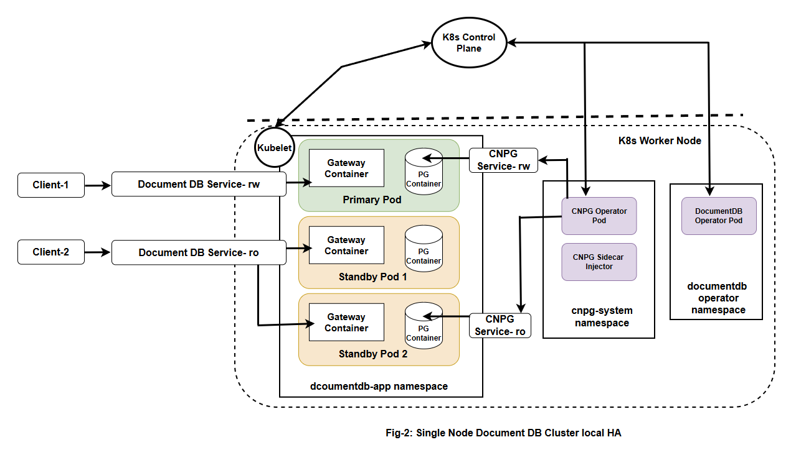

# DocumentDB Kubernetes Operator Upgrade Design

## Overview

This document outlines the upgrade strategy for the DocumentDB Kubernetes operator, which provides a MongoDB-compatible API layer over PostgreSQL using the CloudNative-PG (CNPG) operator. The system consists of multiple components that require coordinated upgrades to ensure service continuity and data integrity.

## Required Knowledge

The following sections provide essential background information for implementing DocumentDB operator upgrades:

### 1. Kubernetes Operators
Kubernetes operators extend the API to manage complex applications through custom resources and controllers that continuously reconcile desired state. Operators use admission webhooks to validate and modify resources during creation and updates.

**Learn more**: [Kubernetes Operator Pattern](https://kubernetes.io/docs/concepts/extend-kubernetes/operator/) | [Operator White Paper](https://github.com/cncf/tag-app-delivery/blob/163962c4b1cd70d085107fc579e3e04c2e14d59c/operator-wg/whitepaper/Operator-WhitePaper_v1-0.md) | [Custom Resources](https://kubernetes.io/docs/concepts/extend-kubernetes/api-extension/custom-resources/) | [Admission Controllers](https://kubernetes.io/docs/reference/access-authn-authz/admission-controllers/)

### 2. DocumentDB Operator Architecture
The DocumentDB operator provides a MongoDB-compatible API over PostgreSQL by orchestrating multiple components: the operator controller, gateway containers for protocol translation, PostgreSQL clusters with DocumentDB extensions, and sidecar injection for seamless integration with CloudNative-PG (CNPG) operator.

**Learn more**: [DocumentDB Operator README](../../../README.md) | [CloudNative-PG Documentation](https://cloudnative-pg.io/documentation/)

### 3. Helm Chart Management
Helm makes Kubernetes application packaging and deployment easy by bundling multiple related resources into a single chart. We provide a DocumentDB operator Helm chart that customers can install with a single command, automatically deploying all necessary components including the DocumentDB operator, CNPG operator, sidecar injector, and associated configurations.

**Learn more**: [Helm Documentation](https://helm.sh/docs/) | [Managing CRDs with Helm](https://helm.sh/docs/chart_best_practices/custom_resource_definitions/) | [Helm Upgrade Process](https://helm.sh/docs/helm/helm_upgrade/)

### 4. PostgreSQL and Extensions
PostgreSQL version upgrades involve considerations for both the database engine and extensions, with major version upgrades requiring data migration and careful compatibility validation. Extension upgrades may modify schemas or data structures independently of the PostgreSQL version.

**Learn more**: [PostgreSQL Versioning Policy](https://www.postgresql.org/support/versioning/) | [PostgreSQL Upgrade Methods](https://www.postgresql.org/docs/current/upgrading.html) | [Extension Management](https://www.postgresql.org/docs/current/extend-extensions.html)

## Architecture Components

The DocumentDB operator consists of five main components distributed across different k8s namespaces and nodes:

### 1. DocumentDB Operator
A custom Kubernetes operator that manages DocumentDB custom resources and orchestrates the creation and lifecycle of CNPG PostgreSQL clusters. Runs in the `documentdb-operator` namespace on worker nodes.

### 2. Gateway Container  
A MongoDB protocol translator that runs as a sidecar container alongside PostgreSQL, converting MongoDB wire protocol requests into Postgres DocumentDB extension calls. Deployed in customer application namespaces on worker nodes.

### 3. PostgreSQL with DocumentDB Extension
A PostgreSQL server enhanced with DocumentDB extensions that enable MongoDB-like document storage and querying capabilities over a relational database. Deployed in customer application namespaces on worker nodes.

### 4. CNPG Sidecar Injector
An admission webhook that automatically injects the DocumentDb Gateway container into CNPG PostgreSQL pods during deployment. Runs in the `cnpg-system` namespace on worker nodes.

### 5. CNPG Operator
The CloudNative-PG operator that handles PostgreSQL cluster lifecycle management, including high availability, backups, and upgrades. Runs in the `cnpg-system` namespace on worker nodes.

### Component Communication Flow

**Control Plane Interaction:**
- All operators (DocumentDB, CNPG, Sidecar Injector) communicate with the Kubernetes API server running on control plane nodes
- The API server validates requests and stores resource definitions in etcd
- The API server directs kubelet agents on worker nodes to apply changes to pods and containers

**Data Plane Deployment:**
- DocumentDB clusters (PostgreSQL + Gateway containers) are deployed in customer-specified application namespaces
- kubelet on worker nodes manages the actual pod lifecycle and container execution
- Application traffic flows directly to Gateway containers in the application namespaces

## Design Principles

Our upgrade strategy follows four core principles:

### 1. Zero-Downtime Principle
All upgrades maintain service availability through rolling updates and automatic rollback on failure.

### 2. Backward Compatibility Principle  
Support N-2 API versions with deprecation cycles (6-months) for gradual migration.

### 3. Fail-Safe Operation Principle
Failed upgrades automatically rollback using atomic Helm operations and change detection.

### 4. Team Autonomy Principle
Clear separation: Kubernetes admins upgrade infrastructure, Database admins coordinate cluster migrations, Database developers execute application-specific migrations.

## Goals and Non-Goals

### Goals
- **Zero-downtime upgrades**: All DocumentDB components upgrade without service interruption
- **Gradual migration capability**: Support API version migration over weeks/months timeline
- **Automated rollback**: Failed upgrades automatically revert to previous stable state
- **Team independence**: Platform and application teams operate on separate timelines
- **Operational simplicity**: Minimize complexity for development teams
- **Data integrity**: Guarantee no data loss during upgrade processes

### Non-Goals
- **Unlimited version history**: Only support N-2 API versions (latest 3 versions maximum)
- **Cross-cloud migration**: Upgrades within same Kubernetes cluster only
- **Automatic data migration**: Breaking schema changes require manual planning
- **Zero-configuration experience**: Some operational knowledge required

## Versioning Strategy

**Important**: DocumentDB uses a **unified versioning strategy** where all components are versioned together for simplicity and compatibility assurance.

### Unified Versioning Approach

**Single Version for All Components:**
- **DocumentDB Operator Version**: `v1.2.3` controls all component versions
- **Gateway Image**: Automatically aligned (e.g., `ghcr.io/microsoft/documentdb/gateway:v1.2.3`)
- **PostgreSQL + Extension**: Automatically aligned (e.g., `mcr.microsoft.com/documentdb/documentdb:16.2-v1.2.3`)
- **Sidecar Injector**: Automatically aligned (e.g., `ghcr.io/microsoft/documentdb/sidecar-injector:v1.2.3`)
- **CNPG Operator**: Locked to DocumentDB version (e.g., DocumentDB v1.2.3 → CNPG v0.24.0)

**Benefits of Unified Versioning:**
- **Simplified Operations**: One version to track instead of managing multiple component versions
- **Guaranteed Compatibility**: All components tested together as a cohesive unit
- **Reduced Complexity**: Eliminates version matrix compatibility issues
- **Easier Rollbacks**: Single version rollback affects all components consistently
- **Clear Release Management**: Single release pipeline for all components

## Upgrade Strategies

### Three-Tier Responsibility Model
Clear separation of platform, data, and application duties to enable parallel progress and safe staged upgrades.

| Role | Primary Scope | Upgrade Ownership |
|------|---------------|------------------|
| Kubernetes Admin | Cluster infrastructure & operators | Phase 1 – Infrastructure upgrade |
| Database Admin (DBA) | Cluster fleet lifecycle & performance | Phase 2 – Cluster API migration |
| Application / Database Developer | App integration & validation | Phase 3 – Application validation |

### Multi-Version Support Architecture
DocumentDB uses a multi-version API approach where a single operator version supports multiple DocumentDB cluster versions simultaneously, enabling gradual migration without forcing upgrades.

- Operator v2: serves cluster API v1 + v2
- Operator v3: serves v1 (deprecated) + v2 + v3
- Operator v4: serves v2 + v3 + v4 (v1 removed)

Deprecation cadence: Version N introduces API vN; N+1 deprecates v(N-1); N+2 removes v(N-1). Operator maintains at most 2–3 active versions.

### Phase 1: Infrastructure Upgrade (Kubernetes Admin)
- Scope: Helm upgrade of unified operator chart (DocumentDB operator, Sidecar Injector, CNPG if required)
- Upgrades: controller, CRDs (add new fields keep old), webhooks, RBAC, sidecar injector, optional CNPG version
- Not Upgraded: existing cluster CRs, gateway image, postgres+extension images, application workloads
- Key Steps:
   - Helm dry-run validation
   - Atomic Helm upgrade (rollback on failure)
   - Operator & webhook health checks
   - Backward compatibility check (new operator reconciles existing clusters)
- Success Criteria:
   - All operator pods Ready
   - Existing clusters stay Healthy/Ready
   - New cluster with new API version can be created

### Phase 2: Cluster Migration (DBA)
Goal: Per-cluster apiVersion/spec bump (e.g. v1→v2) in controlled waves.
Steps per cluster:
1. Pre-checks (recent backup, replication healthy, capacity OK)
2. Server-side dry-run patch
3. Apply manifest (apiVersion + new spec fields)
4. Watch Ready condition & CNPG replication status
5. Smoke test: connect, CRUD, check gateway/extension versions
6. Record outcome or rollback (reapply previous manifest)
Rollback triggers: Ready timeout, sustained latency/error regression, high replication lag, crash loops.

### Phase 3: Application Validation (Developer)
Actions: Validate connectivity, CRUD/index/query latency, error rates, enable new feature flags if desired.
Escalate to DBA on regression; otherwise mark migration complete.

Benefits:
- Clear role separation
- Gradual adoption & controlled risk
- Side-by-side API versions until retirement
- Simple rollback boundaries

For detailed commands & YAML examples see [commands.md](./commands.md).

## Component-Specific Upgrade Considerations

While all components upgrade together, each has specific characteristics:

#### Gateway Image Upgrade (API Version Dependent)
- **State**: **Stateless** - Gateway containers have no persistent state
- **Impact**: Medium (rolling restart of pods when API version changes)
- **Risk**: Low - No data loss risk, only temporary connection disruption
- **Risk Mitigation**: Multiple standby instances with local HA ensure zero-downtime rolling restart; Gateway and PostgreSQL containers run in same pod, sharing HA benefits
- **Version Behavior**: Gateway features may differ between cluster API v1 and v2

#### PostgreSQL Database Upgrade (API Version Dependent)  
- **State**: **Stateful** - PostgreSQL contains persistent application data
- **Impact**: Variable (depends on API version differences)
- **Risk**: Variable - Data migration only required for breaking schema changes
- **Risk Mitigation**: CNPG managed HA with supervised rolling updates for zero-downtime upgrades
- **HA Strategy**: 3-instance clusters (1 primary + 2 standby servers) with CNPG-controlled failover sequence
- **Categories**:
  - **Same PostgreSQL Version**: Cluster API v1 → v2 with same PG version (low risk, configuration change only)
  - **Minor PostgreSQL Version**: Different PG minor versions between API versions (medium risk, CNPG rolling restart with automatic switchover)
  - **Major PostgreSQL Version**: Different PG major versions between API versions (high risk, data migration required with blue-green procedures)

#### DocumentDB Postgres Extension Upgrade (API Version Dependent)
- **State**: **Stateful** - Extension may have API-specific features
- **Impact**: Variable (depends on extension differences between API versions)
- **Risk**: Variable - Extension schema changes only if API versions require different features
- **Risk Mitigation**: Extension compatibility testing during operator upgrade; rollback capability maintains previous extension versions if needed
- **Categories**:
  - **Compatible Extension**: Same extension version for both API versions (low risk)
  - **Enhanced Extension**: New features added for v2 API (medium risk, backward compatible)
  - **Breaking Extension Changes**: Schema modifications required for v2 API (high risk, requires migration planning)

#### Sidecar Injector Upgrade (Supports Multiple API Versions)
- **State**: **Stateless** - Injection webhook has no persistent state
- **Impact**: Medium (affects new pod creation, must support both API versions)
- **Risk**: Medium - Injection failures affect new PostgreSQL pods
- **Risk Mitigation**: Multi-version support ensures existing pods continue running; new pod creation uses appropriate API version configuration
- **Multi-Version Support**: Injector must handle both v1 and v2 cluster configurations

#### CNPG Operator Upgrade (API Version Independent)
- **Trigger**: Upgrade bundled with DocumentDB operator when CNPG version needs updating
- **Scope**: Control plane and data plane
- **Impact**: Variable (depends on CNPG upgrade requirements)
- **Risk Mitigation**: CNPG rolling updates maintain cluster availability; proven PostgreSQL HA mechanisms ensure data safety
- **API Independence**: CNPG typically unchanged between DocumentDB API versions

## Local High Availability (HA) and Upgrade Strategy

DocumentDB leverages CNPG's mature PostgreSQL HA capabilities to provide zero-downtime upgrades through controlled failover orchestration.

### 1. CNPG in Brief (What It Is & How It Works)
CloudNative‑PG (CNPG) is a Kubernetes operator that natively manages highly available PostgreSQL clusters. It watches a `Cluster` custom resource and directly creates / replaces Pods, PVCs, and Services to enforce the desired state.

Core concepts:
- One `Cluster` CR (Custom Resource) declares instance count, storage, replication & update strategy
- Exactly one primary; remaining instances stream WAL as standbys (async or quorum synchronous)
- Read/Write service (`-rw`) always targets the current primary; Read-Only service (`-ro`) load‑balances standbys
- Reconciliation loop: detect spec drift → restart or promote to converge
- Failover vs Switchover: unplanned automatic promotion vs planned controlled promotion
- Supervised mode = human operator triggers the switchover; unsupervised = k8s operator may do it automatically
- Rolling changes: standbys restarted first, then (after switchover) the old primary (full sequence detailed below)

Why it matters for DocumentDB:
- Gateway sidecar lives in every PostgreSQL pod → inherits CNPG’s ordered restart for continuity
- Reuse existing Postgres HA features instead of building custom logic.
- Clear observability (status, events, role labels) simplifies troubleshooting for teams new to CNPG

#### How Local HA Enables Safe Upgrades
Upgrades (image changes, parameter tweaks, API version bumps) rely directly on the HA mechanics:
- Trigger: An operator or Helm chart change updates the CNPG Cluster spec (image / parameters). CNPG detects spec drift.
- Ordering: CNPG restarts standbys first while primary keeps serving writes (maintains availability & avoids write leadership churn early).
- Validation Window: Each restarted standby catches up WAL; if it fails readiness or replication falls behind, you can halt before touching the primary.
- Switchover Decision (Supervised Mode): Promotion only happens when you explicitly run the promote command after verifying lag & health (controlled risk). In unsupervised mode CNPG can promote automatically once standbys are ready — faster, less manual control.
- Primary Restart: After switchover the old primary (now a standby) is restarted; no client connection string changes because Services (-rw / -ro) stay constant.
- Rollback Path: If a standby fails post‑upgrade you still have an unchanged primary + (potentially) another healthy standby; you can revert the spec/image and let CNPG reconcile back.

Operational takeaway: Local HA isn’t separate from upgrade. It is the safety net and sequencing engine that turns a potentially disruptive restart into a controlled, reversible flow.

### 2. Recommended HA Configuration

**3-Instance Cluster Topology:**
- **Instance count**: 3 (1 primary + 2 standby servers) for optimal HA balance
- **Primary update strategy**: Supervised for production (manual controlled switchover), unsupervised for development
- **Planned switchover**: Manually initiated using CNPG promote command while in supervised mode
- **Unplanned failover**: Handled automatically by CNPG (no custom delay fields required)
- **PostgreSQL configuration**: Streaming replication with quorum synchronous replication (e.g., synchronous_standby_names='ANY 1 (*)', synchronous_commit=remote_write) to balance durability and availability

Why 3 instead of 2:
- With only 2 (1 primary + 1 standby) you must choose: synchronous (risk of write stalls if standby slow) or async (risk of small data loss on failover). Three lets you use quorum sync (ANY 1) for durability without stalling on a single standby issue.
- Upgrades / switchover: in a 2-node layout, during restart of the lone standby you temporarily lose HA; with 3 you still have one healthy standby while the other is being cycled.
- Failure tolerance: one standby can fail or be lagging and you still retain HA plus synchronous protection.
- Operational flexibility: allows testing or promoting the most caught‑up standby while another is still catching up.
- Simpler maintenance windows (patching, rebalancing storage) without dropping below 1 healthy standby.

#### Internal CNPG vs External Gateway Services (Essentials)
CNPG creates internal PostgreSQL Services:
`<cluster>-rw` (primary 5432), `<cluster>-ro` (all pods 5432), `<cluster>-r` (replication internals).

DocumentDB exposes Mongo protocol via separate gateway Services on port 10260, not by altering CNPG ones:
`documentdb-gateway-rw` (primary), `documentdb-gateway-ro` (standbys).

Use cases:
- 5432 Services: admin, backups, metrics, internal automation.
- 10260 gateway Services: external client traffic (Mongo wire protocol).

Keep both layers for protocol separation, safer upgrades, security scoping, and to avoid CNPG reconciliation drift.

**Configuration Examples**: See [CNPG HA Configuration Examples](./commands.md#cnpg-ha-configuration-examples) for complete YAML specifications.

### 3. Zero-Downtime Upgrade Sequence

**CNPG Managed Rolling Update Process:**

1. **Standby Server Upgrade Phase** (Automatic):
   - CNPG selects and cycles standby pods before touching the current primary to preserve write availability
   - Order is determined by the operator's internal reconciliation (not StatefulSet ordinal/"serial number") – each standby is drained, restarted with new image/config, then re-attached
   - Primary continues serving traffic throughout

2. **Controlled Switchover Phase** (Manual with Supervised Mode):
   - Check standby lag before switchover to ensure optimal timing
   - Manual switchover to most aligned standby server using CNPG promote command
   - Service endpoints automatically update to new primary

3. **Primary Upgrade Phase** (Automatic):
   - Former primary becomes standby server and receives upgrade
   - New primary (former standby server) continues serving traffic
   - Zero service interruption during transition

**Command Examples**: See [CNPG Zero-Downtime Upgrade Sequence](./commands.md#cnpg-zero-downtime-upgrade-sequence) for step-by-step commands.

### 4. Operational Benefits of CNPG HA

**✅ Built-in Capabilities:**
- **WAL-based replication**: Ensures data consistency during failover between primary and standby servers
- **Automatic service endpoint continuity**: Kubernetes Services (e.g. -rw / -ro) keep stable virtual IPs while their label selectors match the new primary / standby pods after role change (no custom DNS management required)
- **Connection draining**: Graceful client connection handling
- **Monitoring integration**: Real-time standby lag and health metrics
- **Rollback support**: Can revert primary assignment if issues detected

### 5. Risk Mitigation Enhancements

Focus areas and how CNPG covers them:
- **Failure handling**: Automatic failover promotes the most advanced standby (no custom delay tuning required in most cases)
- **Planned change control**: Supervised mode defers primary switchover until an explicit promote, reducing surprise write leadership changes
- **Durability without stalls**: Quorum synchronous replication (e.g. ANY 1) balances data safety and write latency; a single slow standby does not block commits
- **Endpoint stability**: Kubernetes Services keep a stable virtual IP / DNS name; role change only swaps matching pod backends (no application reconfiguration)
- **Operational visibility**: Cluster status + pod role labels + pg_stat_replication provide live lag and role insight for go / no‑go decisions
- **Upgrade safety**: Replica-first (standby-first) rolling restarts retain continuous write availability before controlled switchover

Result: Predictable, observable failover & upgrade flows with minimized write interruption and bounded data loss risk.

### 6. Failover / Switchover Timing (No SLA – Empirical Ranges)

DocumentDB inherits CNPG timing characteristics. No formal SLA is provided; measure in your own environment. Open‑source operator behavior and internal tests suggest these typical windows under healthy conditions:

Planned switchover (supervised promote):
- Primary write leadership change: ~2–5s (WAL switch + Service/label update)
- Former primary pod restart (during rolling upgrade): additional 10–40s (does not block writes)

Unplanned primary pod crash (node healthy):
- Failure detection (readiness/liveness probe → container restart decision): 2–10s
- Promotion + Service update: ~2–5s
- Typical write unavailability: 5–15s total

Unplanned node failure:
- Node NotReady detection (default controller grace / heartbeats): up to ~40s (tunable)
- Promotion + Service update after pod eviction: ~2–5s
- Typical window: 20–60s (optimize by tightening node heartbeat/grace if acceptable)

Primary determinants: probe intervals & thresholds, node heartbeat config, replication lag, synchronous commit settings, storage and network latency. Perform periodic controlled drills (supervised promote, pod kill, node simulate) and record observed gaps between last successful and first resumed write to establish internal benchmarks.

## Multi-Node Upgrade Strategy (Future Enhancement)

**Multi-Node Upgrade Considerations**: While this document focuses on single-node DocumentDB clusters with local HA (1 primary + 2 standby servers per node as an example), future multi-node deployments will support horizontal scaling using multiple PostgreSQL clusters managed by Citus. This document provides some high level idea and the detials will be covered in a separate multi-node upgrade design doc.

### Citus Integration for Multi-Node Architecture

DocumentDB will leverage **Citus** (PostgreSQL extension for distributed SQL) to enable horizontal scaling through multi-node deployments. This integration requires enhancements to the CNPG operator to support Citus-specific cluster topologies.

**Multi-Node Architecture with Citus**

The Citus cluster architecture consists of a single coordinator node that manages distributed queries and metadata, along with multiple worker nodes that provide horizontal scaling capabilities. Each node maintains its own high availability configuration, with the coordinator node running 1 primary plus 2 standby servers managed by CNPG, and each worker node following the same HA pattern. For example, a deployment with 3 worker nodes would result in 9 total PostgreSQL instances (3 primaries and 6 standby servers). Citus MX handles intelligent query routing and distributed transaction coordination across all nodes, while the sharding strategy automatically distributes data across worker nodes based on document keys.

**CNPG Integration Requirements**

To support this architecture, CNPG will need several enhancements including cluster-level configuration support for Citus coordinator and worker node specifications, enhanced service discovery for inter-node communication, coordinated backup procedures across all Citus nodes, and orchestrated upgrades that maintain Citus cluster consistency throughout the process.

**Upgrade Complexity Considerations**

Multi-node upgrades introduce significant complexity that requires careful consideration of node upgrade sequencing based on availability zones, traffic balancing across worker nodes, cross-node dependency analysis, and risk mitigation strategies such as upgrading non-critical worker nodes before the coordinator node. The primary orchestration challenges include synchronizing upgrades across distributed worker nodes, maintaining data consistency during worker node upgrades, handling partial upgrade failures across multiple nodes, coordinating Citus metadata updates during upgrades, and ensuring Citus MX routing remains functional throughout the upgrade process.

**Citus-Specific Upgrade Strategy**

The upgrade strategy must account for several Citus-specific considerations. The sequencing strategy needs to determine whether to upgrade worker nodes first or the coordinator first, based on Citus version compatibility requirements. Metadata synchronization becomes critical to ensure Citus metadata consistency during rolling upgrades across nodes. Shard rebalancing must be coordinated during worker node upgrades to manage data redistribution effectively. Additionally, maintaining Citus MX routing functionality during node transitions and managing inter-node connectivity during upgrade phases are essential for seamless operations.

## Multi-Region Upgrade Strategy (Future Enhancement)

**Multi-Region Upgrade Considerations**: While multi-node deployments focus on horizontal scaling within a single location, future multi-region deployments will address geographic distribution challenges across different regions, clouds, or data centers using a primary-replica region architecture. Multi-region upgrades introduce additional complexity including cross-region network latency considerations, provider-specific maintenance windows, data sovereignty and compliance requirements, regional disaster recovery coordination, and potential split-brain scenarios during network partitions between regions. The orchestration strategy will need to account for replica-first upgrade sequencing (upgrading replica regions before the primary region), cross-region data consistency validation between primary and replica regions, region-specific rollback procedures, and coordinated monitoring across geographically distributed infrastructure. This multi-region upgrade strategy will be addressed in a dedicated design document when DocumentDB expands beyond single-region deployments.

## Failure Modes and Recovery

1. Helm upgrade / CRD change fails
   - Impact: New CR creation blocked; existing clusters keep running
   - Detect: Helm timeout/errors
   - Recover: Automatic rollback (`--atomic`); if partial, delete new CRD + redeploy previous chart
   - Prevent: Mandatory dry-run + test upgrade in lower envs

2. Operator crash loop after upgrade
   - Impact: Reconciliation paused; running clusters unaffected
   - Detect: Pod restart loop / liveness probe failures
   - Recover: Rollback chart; inspect logs/resources; adjust limits
   - Prevent: Resource limits + readiness/liveness tuned

3. Cluster API migration fails
   - Impact: Single cluster degraded
   - Detect: Ready condition not true within window / errors in status
   - Recover: Reapply previous manifest (apiVersion/spec); restore from backup if corruption
   - Prevent: Pre-migration backup + health/lag checks + dry-run patch

4. Gateway container fails on new API
   - Impact: App connectivity loss (one cluster)
   - Detect: CrashLoopBackOff / failed health probes
   - Recover: Roll back gateway image; restart pod
   - Prevent: Canary migration + image compatibility tests

5. Network partition / replica divergence risk
   - Impact: Potential replication lag or write blockage (split-brain prevented by single primary design)
   - Detect: Elevated replication lag; unexpected role changes; timeline anomalies
   - Recover: Allow CNPG failover; if divergence suspected, promote known-good standby and reattach others
   - Prevent: Stable network, monitoring lag & role labels

6. Concurrent migrations overload resources
   - Impact: Multiple clusters slow / fail
   - Detect: Resource saturation (CPU/memory), multiple Ready timeouts
   - Recover: Pause further migrations; rollback affected clusters
   - Prevent: Throttle batch size; enforce migration schedule

Rollback Golden Rules:
- Always have recent logical/physical backup before Phase 2
- Automate fast rollback for stateless/operator issues; keep manual confirmation for data changes
- Track each migration (cluster, from→to, start/finish, result) for audit

## Global Upgrade Observability

Monitor these during any upgrade / migration / failover drill; they drive go / pause / rollback decisions:

Key Metrics & Signals:
- Replication lag (LSN or write/replay lag) – sustained growth pre‑switchover => pause
- Synchronous quorum intact (>=1 candidate) – loss lowers durability
- Promotion events (PrimaryChanged / SwitchoverCompleted) – unexpected extras => investigate
- Pod readiness (primary & standbys) – flapping or prolonged NotReady => halt
- Gateway vs Postgres readiness gap – >2m divergence => potential translation issue
- Write TPS & p99 latency – >2x baseline for >5m post‑promotion => rollback candidate
- Error rate (client/gateway) – spike correlates with availability window length
- CPU & I/O latency on promoting standby – saturation slows WAL apply
- Disk fsync latency – rising trend increases promotion duration
- Node NotReady events – extend failover window; correlate with timing

Suggested Rollback Threshold Examples (tune internally):
- Replication lag >30s before manual promote
- Healthy standby count <2 (in 3-node topology) at switchover decision
- Post‑promotion write latency >2x baseline sustained 5m
- Gateway readiness failures >2m after Postgres Ready

Minimal Dashboard:
1. Replication lag & quorum status
2. Promotion / failover event timeline
3. TPS & latency with annotated promotions
4. Error rate (app + gateway)
5. Pod readiness / restarts
6. Resource (CPU, I/O, fsync) for primary & candidate standby

Outcome: Rapid anomaly detection, objective rollback triggers, historical baseline to refine timing expectations.

## Trade-off Analysis

- Unified Component Version vs Independent Component Versions: A single unified version simplifies operations and guarantees compatibility, at the cost of less flexibility to patch components independently.
- Multi-Version API Support vs Single Version Enforcement: Serving multiple API versions concurrently enables gradual cluster migration and reduces pressure on teams, while increasing operator complexity and test scope.
- Rolling Upgrades vs Always Blue-Green: Rolling upgrades minimize extra infrastructure and networking overhead, accepting slightly higher in-place change risk; blue‑green is reserved for exceptional high‑risk cases.
- Hybrid Rollback Strategy vs Full Automation: Automating rollbacks for stateless pieces and keeping manual judgment for stateful data preserves data safety while adding a small decision delay.
- Role Separation (K8s Admin / DBA / App Dev) vs Single Owning Team: Splitting responsibilities aligns expertise and allows parallel work, introducing some coordination overhead.

## Implementation Reference

For detailed command examples, scripts, and operational procedures, see:

**[Command Reference Guide](./commands.md)** - Complete command examples for:
- Multi-version API workflow commands
- Infrastructure upgrade procedures
- Cluster API migration examples
- CNPG supervised HA upgrade procedures
- Rollback and emergency procedures
- Component hash tracking scripts
- Blue-green deployment procedures